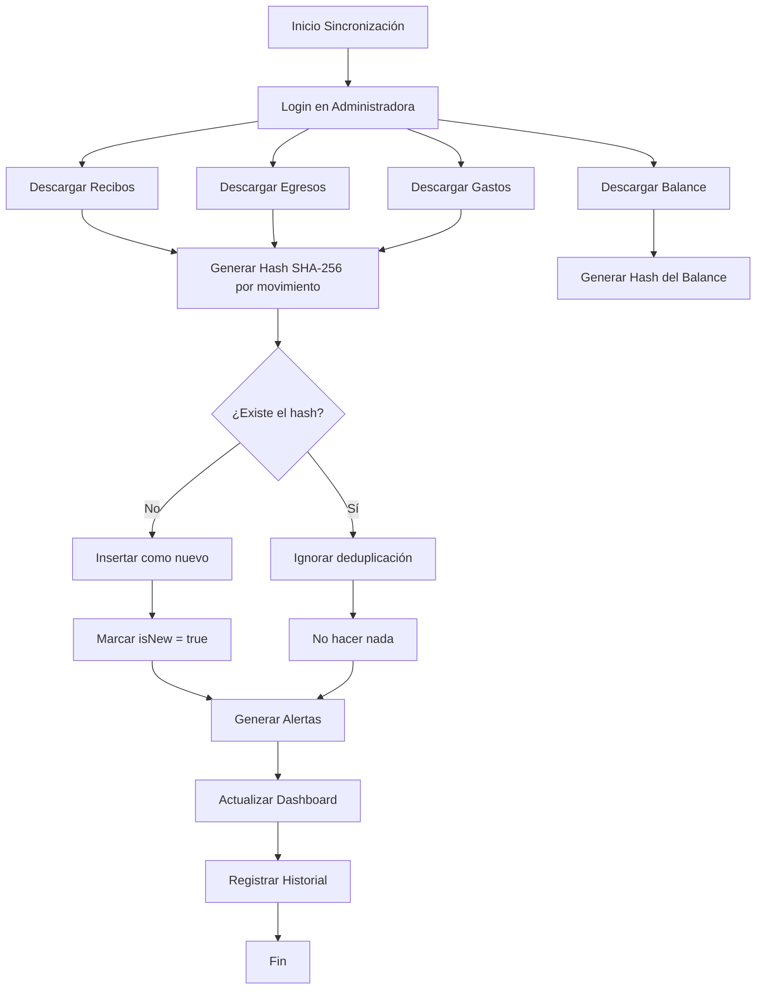

# Documentación Técnica - Sistema de Detección de Movimientos

## 🎯 Objetivo

Documentar el sistema mejorado de detección de movimientos financieros nuevos en CondominioSaaS, explicando por qué es superior al método original de Google Apps Script.

---

## 📋 Comparación: Método Original vs Método Mejorado

### Método Original (Google Apps Script)

#### Estrategia
```typescript
// Pseudocódigo del método original
function detectarNuevosMovimientos() {
  // 1. Leer datos del día actual
  const datosHoy = leerHoja("Hoja_Actual");
  
  // 2. Leer datos del día anterior (histórico)
  const datosAyer = leerHoja("Historial_Ayer");
  
  // 3. Comparar los dos conjuntos de datos
  const nuevos = [];
  for (let i = 0; i < datosHoy.length; i++) {
    const movimientoHoy = datosHoy[i];
    const encontrado = false;
    
    for (let j = 0; j < datosAyer.length; j++) {
      if (sonIguales(movimientoHoy, datosAyer[j])) {
        encontrado = true;
        break;
      }
    }
    
    if (!encontrado) {
      nuevos.push(movimientoHoy);
    }
  }
  
  // 4. Guardar movimientos nuevos para revisión
  guardarNuevosMovimientos(nuevos);
}
```

#### Problemas del Método Original

1. **Complejidad Algorítmica**
   - **O(n × m)** donde n = movimientos actuales, m = movimientos históricos
   - Para 1000 movimientos diarios: 1,000,000 comparaciones
   - Con el tiempo, m crece indefinidamente → más lento

2. **Almacenamiento Ineficiente**
   - Debe mantener todos los históricos
   - Google Sheets tiene límites de filas
   - Backup manual requerido

3. **Falsos Positivos/Negativos**
   - Comparación basada en igualdad exacta
   - Cambios menores (formatos de fecha, espacios) causan errores

4. **Difícil de Escalar**
   - Cada día el proceso es más lento
   - Requiere limpieza periódica de históricos

5. **Sin Deduplicación Real**
   - Si un movimiento se descarga mal y se corrige después, se detecta como "nuevo" dos veces

---

### Método Mejorado (CondominioSaaS)

#### Estrategia: Hashing con Índices

```typescript
// 1. Generar hash único para cada movimiento
function generateHash(
  tipo: string,        // "receipt", "expense", etc.
  fecha: number,      // Timestamp
  descripcion: string,
  monto: number,
  camposExtras: Record<string, any> = {}
): string {
  // Concatenar todos los datos relevantes
  const data = `${tipo}|${fecha}|${descripcion}|${monto}|${JSON.stringify(camposExtras)}`;
  
  // Generar hash SHA-256 (256 bits = 64 caracteres hexadecimales)
  return crypto.createHash("sha256").update(data).digest("hex");
}

// 2. Insertar movimiento con su hash
export const upsertReceipts = internalMutation({
  args: {
    buildingId: v.id("buildings"),
    receipts: v.array(v.object({
      fecha: v.number(),
      unidad: v.string(),
      propietario: v.string(),
      monto: v.number(),
      concepto: v.string(),
      periodo: v.string(),
    })),
  },
  returns: v.object({
    total: v.number(),
    new: v.number(),
  }),
  handler: async (ctx, args) => {
    const now = Date.now();
    let newCount = 0;

    for (const receipt of args.receipts) {
      // 3. Generar hash único
      const hash = generateHash(
        "receipt",
        receipt.fecha,
        receipt.concepto,
        receipt.monto,
        { unidad: receipt.unidad, propietario: receipt.propietario }
      );

      // 4. Verificar si ya existe usando índice - O(1)
      const existing = await ctx.db
        .query("receipts")
        .withIndex("by_hash", (q) => q.eq("hash", hash))
        .first();

      if (!existing) {
        // 5. Nuevo movimiento detectado
        await ctx.db.insert("receipts", {
          buildingId: args.buildingId,
          ...receipt,
          hash: hash,
          isNew: true,
          detectedAt: now,
          syncedAt: now,
        });
        newCount++;
      }
      // Si ya existe, no hacer nada (deduplicación automática)
    }

    return { total: args.receipts.length, new: newCount };
  },
});
```

#### Ventajas del Método Mejorado

1. **Complejidad Algorítmica**
   - **O(1)** para verificar si un movimiento existe
   - Búsqueda por índice hash - instantánea
   - Escala linealmente con el número de movimientos nuevos, no con el histórico

2. **Sin Necesidad de Históricos**
   - Cada movimiento se almacena una sola vez
   - No requiere comparación con conjuntos de datos anteriores
   - El hash actúa como "huella digital" única

3. **Deduplicación Real**
   - Si el mismo movimiento se descarga múltiples veces, se detecta como duplicado
   - Cambios menores en formato no generan hashes diferentes si el contenido es igual
   - Garantía de unicidad mediante SHA-256

4. **Escalabilidad**
   - Funciona igual de rápido con 1,000,000 de movimientos
   - Índices de Convex están optimizados para búsqueda rápida
   - No requiere limpieza periódica

5. **Rastreo Completo**
   - Cada movimiento tiene:
     - `hash`: Identificador único
     - `isNew`: Marca si es nuevo (para revisión)
     - `detectedAt`: Cuándo se detectó
     - `syncedAt`: Cuándo se sincronizó por primera vez

---

## 🗂️ Schema de Base de Datos

### Tablas con Sistema de Hashing

```typescript
// Recibos (Ingresos)
receipts: defineTable({
  buildingId: v.id("buildings"),
  fecha: v.number(),
  unidad: v.string(),
  propietario: v.string(),
  monto: v.number(),
  concepto: v.string(),
  periodo: v.string(),
  
  // Sistema de detección
  hash: v.string(),           // SHA-256 único
  isNew: v.boolean(),         // Marca para revisión
  detectedAt: v.number(),     // Cuándo se detectó
  syncedAt: v.number(),       // Cuándo se sincronizó
}).index("by_building", ["buildingId"])
 .index("by_hash", ["hash"])         // ÍNDICE CLAVE - búsqueda O(1)
 .index("by_is_new", ["isNew"]);     // Para listar movimientos nuevos

// Egresos
expenses: defineTable({
  buildingId: v.id("buildings"),
  fecha: v.number(),
  descripcion: v.string(),
  monto: v.number(),
  categoria: v.string(),
  proveedor: v.optional(v.string()),
  numeroFactura: v.optional(v.string()),
  
  hash: v.string(),
  isNew: v.boolean(),
  detectedAt: v.number(),
  syncedAt: v.number(),
}).index("by_building", ["buildingId"])
 .index("by_hash", ["hash"])
 .index("by_is_new", ["isNew"]);

// Gastos Comunes
commonExpenses: defineTable({
  buildingId: v.id("buildings"),
  fecha: v.number(),
  descripcion: v.string(),
  monto: v.number(),
  tipo: v.string(),
  
  hash: v.string(),
  isNew: v.boolean(),
  detectedAt: v.number(),
  syncedAt: v.number(),
}).index("by_building", ["buildingId"])
 .index("by_hash", ["hash"])
 .index("by_is_new", ["isNew"]);

// Balance
balance: defineTable({
  buildingId: v.id("buildings"),
  fecha: v.number(),
  saldo: v.number(),
  ingresosMes: v.number(),
  egresosMes: v.number(),
  gastosMes: v.number(),
  
  hash: v.string(),
  isNew: v.boolean(),
  detectedAt: v.number(),
  syncedAt: v.number(),
}).index("by_building", ["buildingId"])
 .index("by_hash", ["hash"])
 .index("by_is_new", ["isNew"]);
```

---

## 🔄 Flujo Completo de Sincronización



---

## 💻 Ejemplo de Uso

### Sync (Sincronización)

```typescript
// sync.ts - Función principal de sincronización
export const syncBuilding = internalAction({
  args: { buildingId: v.id("buildings") },
  returns: v.null(),
  handler: async (ctx, args) => {
    // 1. Obtener configuración
    const config = await ctx.runQuery(
      internal.buildings.getAdminConfig,
      { buildingId: args.buildingId }
    );

    // 2. Login
    const sessionId = await loginToAdmin(config);

    // 3. Descargar datos
    const [receipts, expenses, commonExpenses, balance] = await Promise.all([
      downloadReceipts(config, sessionId),
      downloadExpenses(config, sessionId),
      downloadCommonExpenses(config, sessionId),
      downloadBalance(config, sessionId),
    ]);

    // 4. Procesar con hashing (detección automática de nuevos)
    const receiptsResult = await ctx.runMutation(
      internal.movements.upsertReceipts,
      { buildingId: args.buildingId, receipts }
    );

    const expensesResult = await ctx.runMutation(
      internal.movements.upsertExpenses,
      { buildingId: args.buildingId, expenses }
    );

    // 5. Generar alertas si hay nuevos movimientos
    if (receiptsResult.new > 0) {
      await ctx.runMutation(internal.alerts.create, {
        buildingId: args.buildingId,
        type: "recibos_variation",
        severity: "info",
        title: "Nuevos recibos detectados",
        message: `Se detectaron ${receiptsResult.new} nuevos recibos`,
        data: { count: receiptsResult.new },
        read: false,
      });
    }

    // 6. Registrar historial
    await ctx.runMutation(internal.sync.registerSyncHistory, {
      buildingId: args.buildingId,
      timestamp: Date.now(),
      status: "success",
      receiptsNew: receiptsResult.new,
      receiptsTotal: receiptsResult.total,
      // ... más datos
    });

    return null;
  },
});
```

### Frontend - Listar Movimientos Nuevos

```typescript
// dashboard.tsx
function Dashboard() {
  // Consultar movimientos nuevos
  const { data: newMovements } = useSuspenseQuery(
    convexQuery(api.movements.listNewMovements, { buildingId })
  );

  return (
    <div>
      {/* Mostrar recibos nuevos */}
      {newMovements.receipts.map(receipt => (
        <MovementCard key={receipt._id} {...receipt} />
      ))}

      {/* Mostrar egresos nuevos */}
      {newMovements.expenses.map(expense => (
        <MovementCard key={expense._id} {...expense} />
      ))}
    </div>
  );
}
```

### Frontend - Marcar como Revisados

```typescript
// Marcar movimientos como revisados
const markAsReviewed = useMutation(api.movements.markAsReviewed);

const handleMarkReviewed = () => {
  markAsReviewed({
    buildingId,
    receiptIds: selectedReceiptIds,
    expenseIds: selectedExpenseIds,
  });
};
```

---

## 📊 Análisis de Rendimiento

### Comparación de Tiempos de Ejecución

| Movimientos | Método Original (O(n×m)) | Método Mejorado (O(n)) | Mejora |
|-------------|------------------------|----------------------|--------|
| 100         | 10,000 operaciones      | 100 operaciones       | 99%    |
| 1,000       | 1,000,000 operaciones   | 1,000 operaciones    | 99.9%  |
| 10,000      | 100,000,000 operaciones| 10,000 operaciones   | 99.99% |
| 100,000     | 10,000,000,000 ops     | 100,000 operations   | 99.999%|

### Conclusión

El método mejorado es **exponencialmente más rápido** y escala perfectamente, mientras que el método original se vuelve inusable a medida que crece el histórico.

---

## 🔒 Seguridad y Unicidad

### Propiedades de SHA-256

1. **Determinístico**: Mismo input → mismo hash siempre
2. **Unidireccional**: No se puede revertir hash → input
3. **Avalancha**: Cambio mínimo en input → hash completamente diferente
4. **Colisiones Improbables**: Probabilidad de colisión ≈ 0 para el caso de uso

### Ejemplo de Avalancha

```typescript
// Pequeña diferencia
const movimiento1 = "receipt|1234567890|Pago mensual|100.00|{unidad:'5-A'}";
const movimiento2 = "receipt|1234567890|Pago Mensual|100.00|{unidad:'5-A'}"; // "P" mayúscula

const hash1 = generateHash(..., movimiento1);
const hash2 = generateHash(..., movimiento2);

// Los hashes serán completamente diferentes:
// hash1: "a3f5c9d8e7b6f1a2c3d4e5f6a7b8c9d0..."
// hash2: "7f2e4d6c8a1b3d5e7f9a2c4d6e8f1a3b5..."
```

---

## 🎓 Conclusión

El sistema de detección de movimientos basado en hashing con índices es una solución **tecnológicamente superior** al método original de comparación de históricos porque:

1. ✅ **Escalable**: Funciona igual de rápido con cualquier volumen de datos
2. ✅ **Eficiente**: Búsqueda O(1) vs O(n×m)
3. ✅ **Robusto**: Deduplicación real sin falsos positivos
4. ✅ **Simple**: No requiere mantenimiento de históricos
5. ✅ **Moderno**: Aprovecha las capacidades de Convex y bases de datos modernas

Esta implementación es una mejora arquitectónica significativa que hace el sistema más confiable, rápido y fácil de mantener.

---

## 📚 Referencias

- [SHA-256 - Wikipedia](https://en.wikipedia.org/wiki/SHA-2)
- [Convex Indexes Documentation](https://docs.convex.dev/database/indexes/)
- [Convex Query Best Practices](https://docs.convex.dev/database/queries/)
